# IPQ 用户操作手册

- 演示环境：Komari `http://127.0.0.1:8080` · IPQ `http://127.0.0.1:8090`
- 演示节点：`IPQ 手册演示节点`
- 演示目标 IP：`1.1.1.1`、`8.8.8.8`

## 说明

- 本手册的截图全部来自真实点击流程，不是手工拼图。
- 覆盖范围包括：接入配置、Komari 注入、多 IP 上报、当前详情、历史记录、快照对比、收藏快照、游客只读、历史保留、用户设置，以及默认主题和 PurCarte 主题下的注入体验。
- 接入命令在演示过程中按页面生成内容原样执行，节点侧没有手工补参数。

## 操作步骤

### 1. Komari 初始空白页

- 目的：从空数据开始演示，方便看清节点是如何一步步接入到 IPQ 的。
- 操作：在空数据状态下打开 Komari 首页。
- 结果：通过

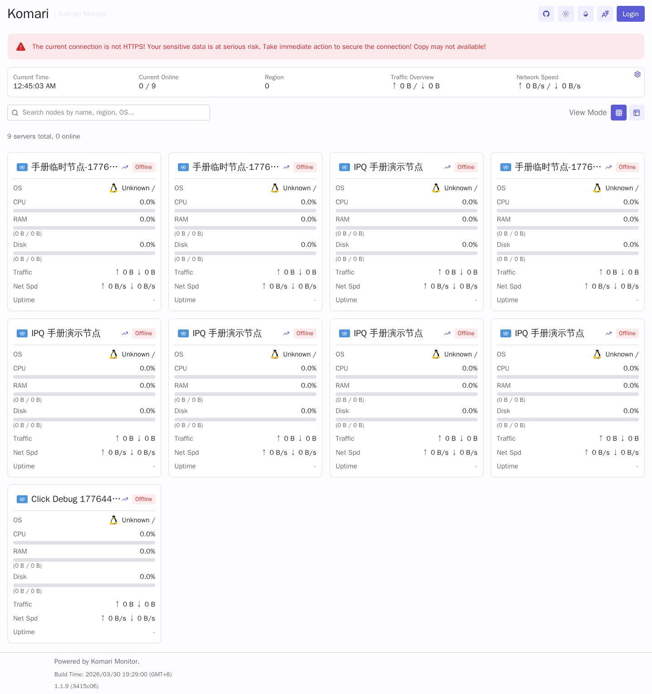

### 2. 登录 Komari 管理后台

- 目的：先登录 Komari，后续才能创建节点、写入自定义 Header 和切换主题。
- 操作：在 Komari 首页点击登录，输入默认账号 `admin / admin`。
- 结果：通过

### 3. 进入 Komari 后台首页

- 目的：确认已经进入 Komari 管理工作区。
- 操作：提交登录表单后进入 `/admin`。
- 结果：通过

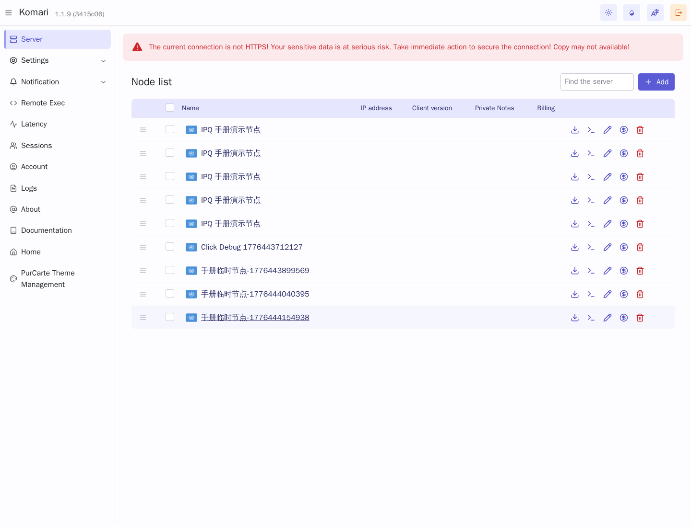

### 4. 创建 Komari 节点

- 目的：IPQ 依赖 Komari 节点 UUID 建立映射，所以要先在 Komari 中创建节点。
- 操作：在 Komari 节点管理页点击 Add，填写节点名称“IPQ 手册演示节点”。
- 结果：通过

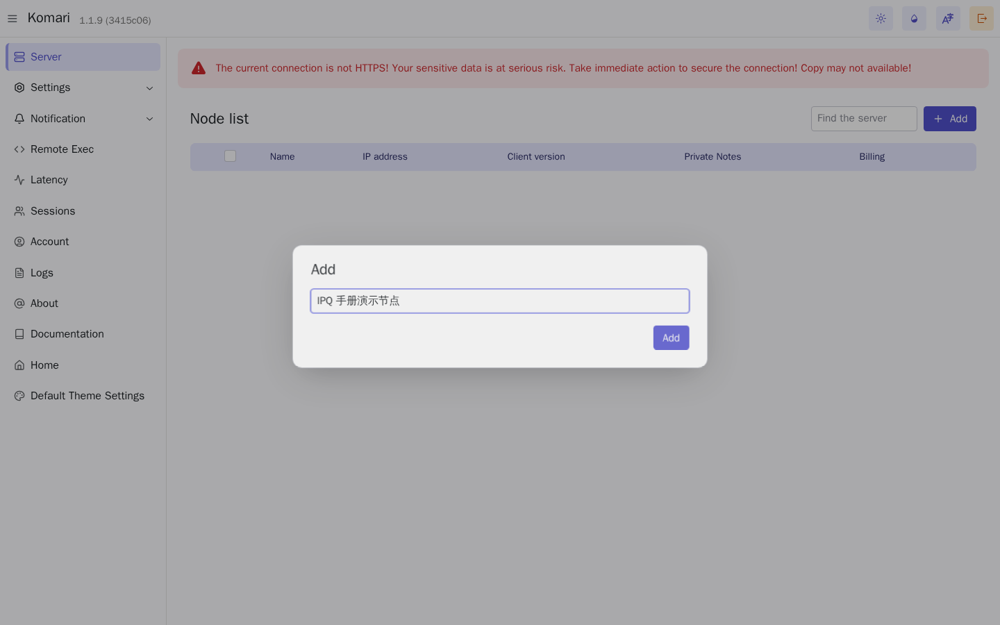

### 5. 节点创建完成

- 目的：确认演示节点已经出现在 Komari 列表中。
- 操作：提交创建表单后，节点出现在 Komari 首页列表。
- 结果：通过

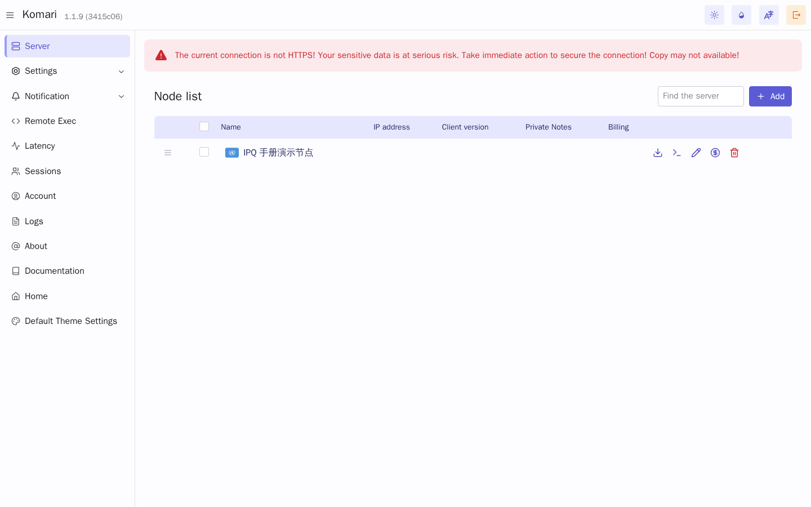

### 6. 登录 IPQ 后台

- 目的：进入 IPQ 管理后台，后续配置接入代码和节点上报。
- 操作：在 IPQ 登录页输入默认账号 `admin / admin`。
- 结果：通过

### 7. IPQ 初始节点列表为空

- 目的：在节点真正接入之前，IPQ 节点页不会出现任何数据。
- 操作：登录 IPQ 后打开节点列表。
- 结果：通过

### 8. 查看接入配置页

- 目的：接入配置页集中提供接入地址、游客只读、loader 版 Header 和完整内联版 Header。
- 操作：打开 IPQ 的“接入配置”页面。
- 结果：通过

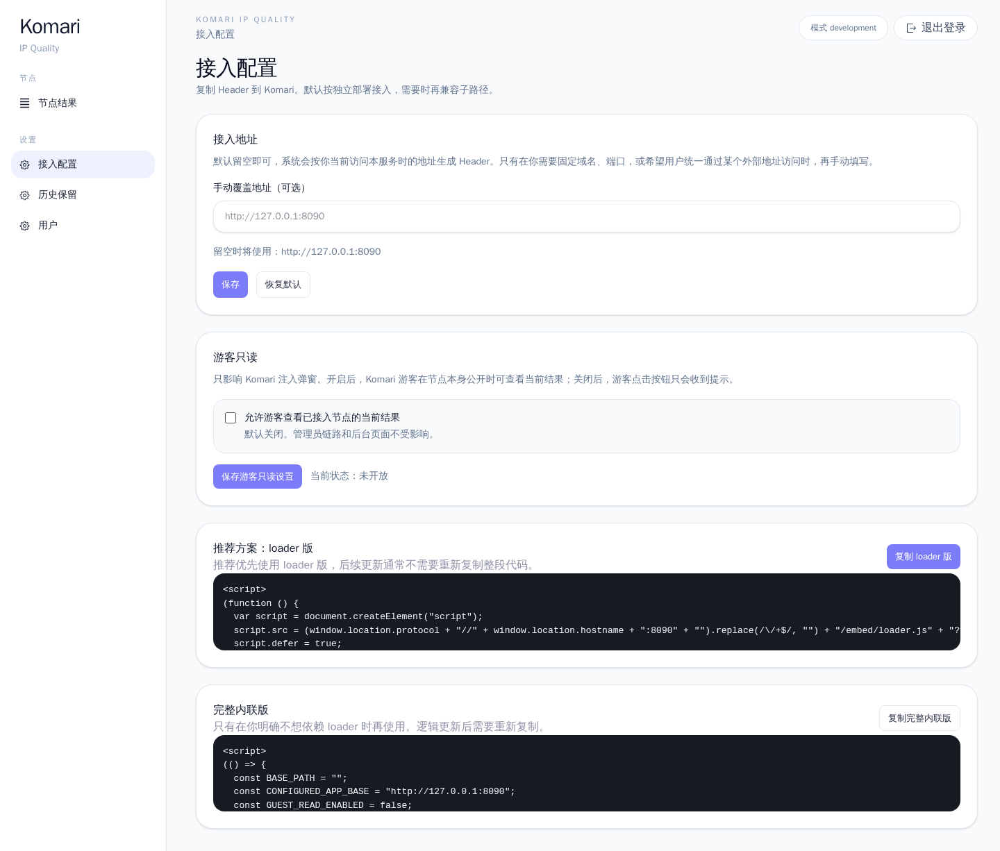

### 9. 查看完整内联版代码

- 目的：如果不想依赖 loader，也可以使用完整内联版 Header。
- 操作：滚动到“完整内联版”区域，查看备用的完整内联代码。
- 结果：通过

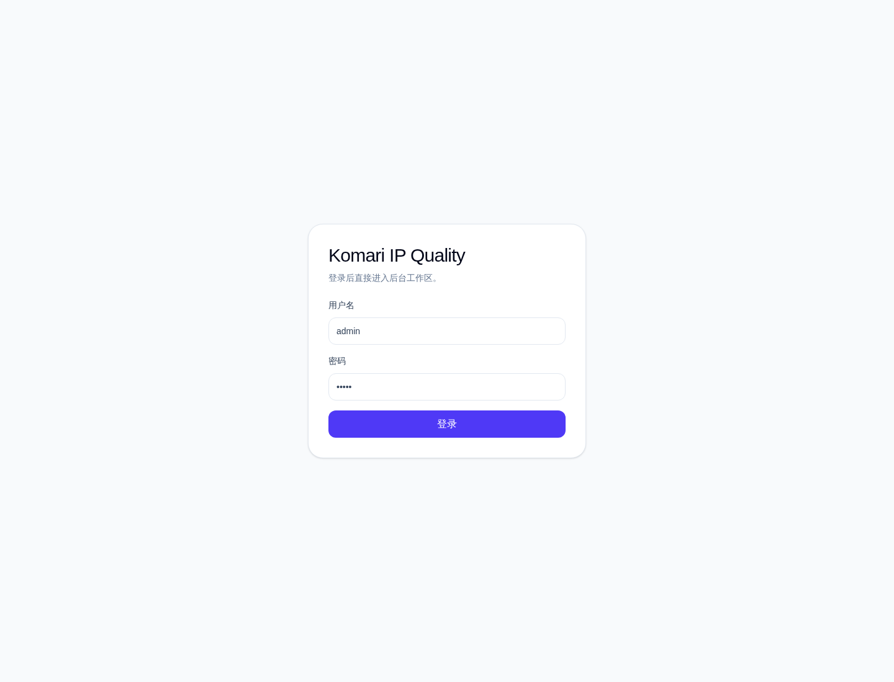

### 10. 将 Header 注入到 Komari

- 目的：只需要把 IPQ 生成的 Header 粘贴到 Komari 的 Custom Header 中，就能启用注入按钮。
- 操作：进入 Komari 的 Site 设置，把 loader 版代码粘贴到 `Custom Header`。
- 结果：通过

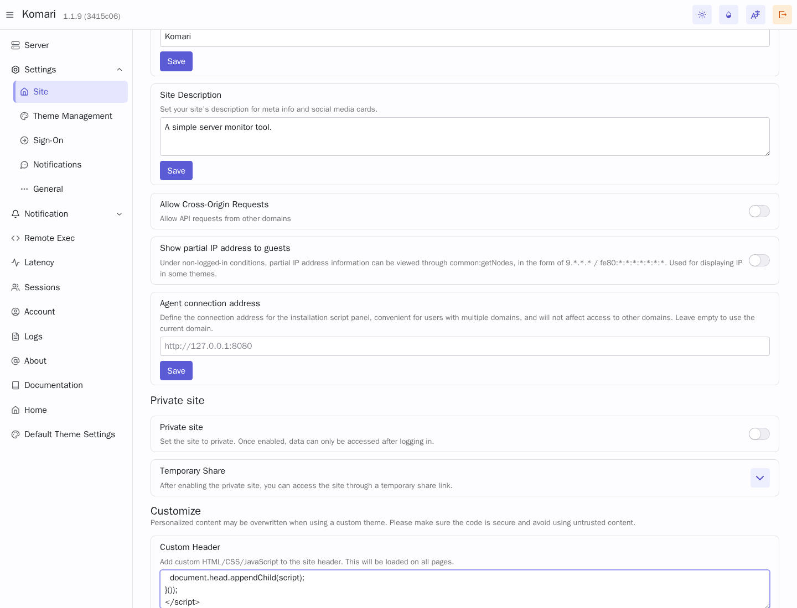

### 11. 保存 Komari Header

- 目的：保存之后，Komari 页面会自动加载 IPQ 注入层。
- 操作：点击 Custom Header 区域下方的 Save。
- 结果：通过

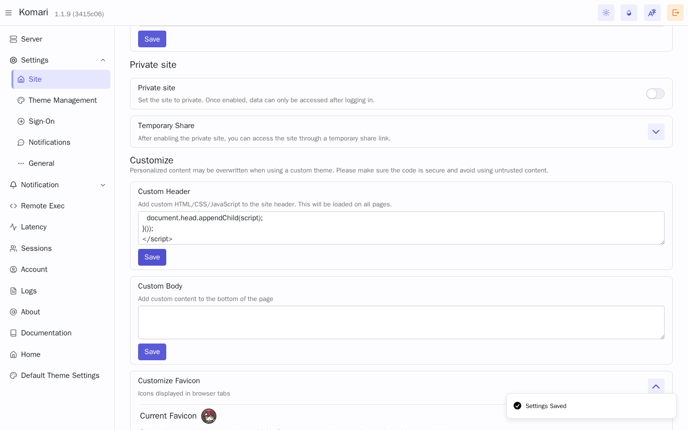

### 12. 在 Komari 节点详情中看到注入入口

- 目的：注入成功后，节点详情页会出现“IPQ”入口，管理员可以直接从 Komari 内操作。
- 操作：打开刚创建的 Komari 节点详情页，确认注入按钮已出现。
- 结果：通过

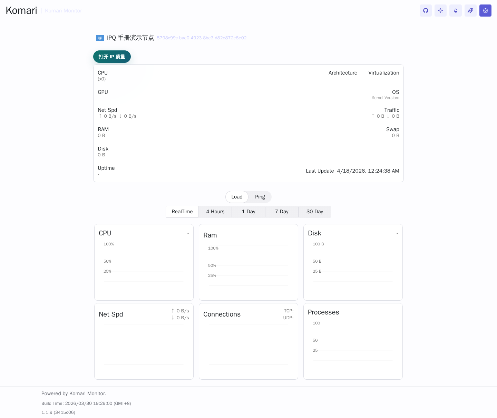

### 13. 通过注入入口接入节点

- 目的：未接入的节点会先走独立接入页面，接入完成后就能继续在 Komari 弹窗中查看。
- 操作：点击注入按钮，完成节点接入。
- 结果：通过

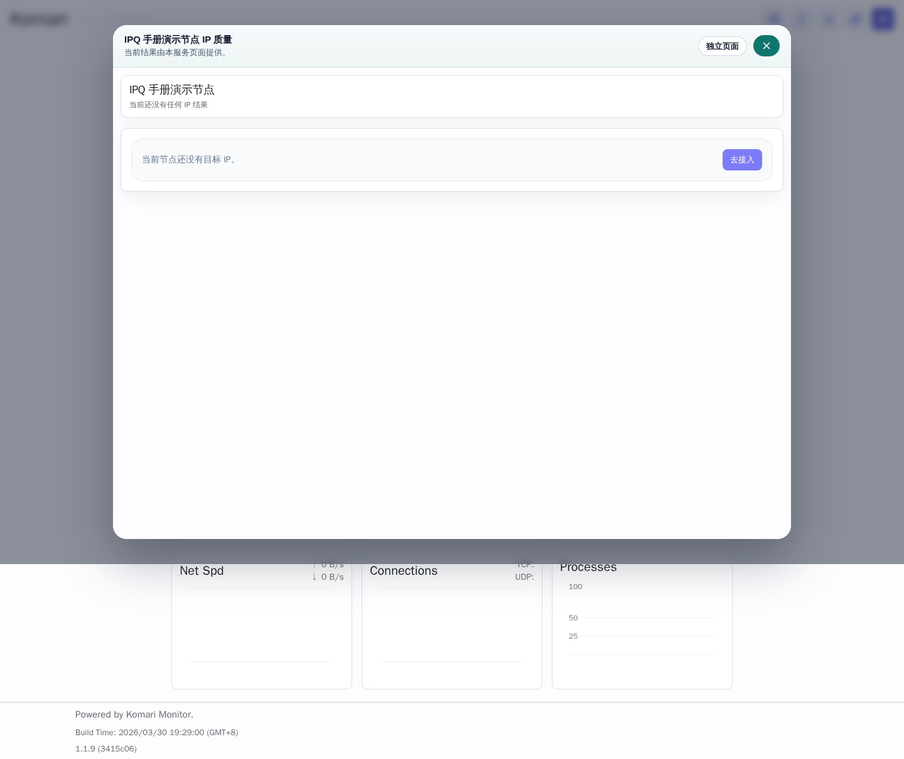

### 14. 节点出现在 IPQ 列表中

- 目的：节点接入后，会出现在 IPQ 的节点列表中，状态初始为“无数据”。
- 操作：回到 IPQ 节点列表，确认刚接入的节点已经出现。
- 结果：通过

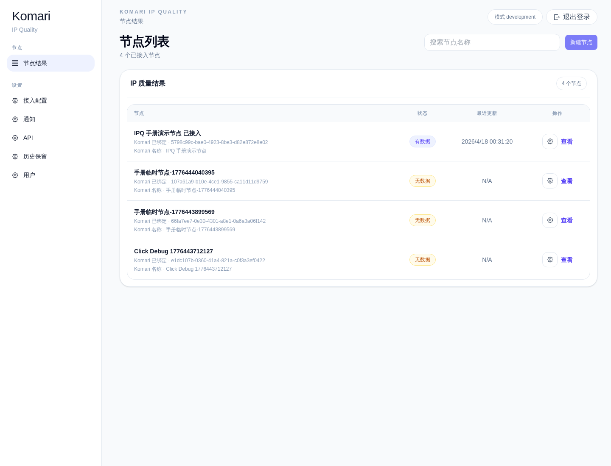

### 15. 打开上报设置

- 目的：上报设置弹窗用于管理目标 IP、执行周期和接入命令。
- 操作：点击节点行内的齿轮图标，打开“节点上报设置”。
- 结果：通过

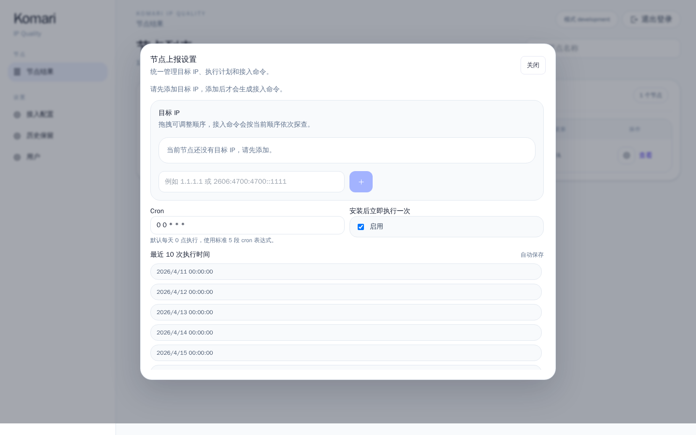

### 16. 配置多个目标 IP 和执行计划

- 目的：一个节点可以维护多个目标 IP。Cron 和“安装后立即执行一次”会实时保存，底部接入命令也会随配置变化。
- 操作：在上报设置里添加 `1.1.1.1`、`8.8.8.8` 两个目标 IP，并把 Cron 调整为 `*/30 * * * *`。
- 结果：通过

### 17. 复制接入命令

- 目的：接入命令会根据当前节点配置动态生成，重复执行同一条命令只会覆盖更新本地配置。
- 操作：点击接入命令右侧的“复制”。
- 结果：通过

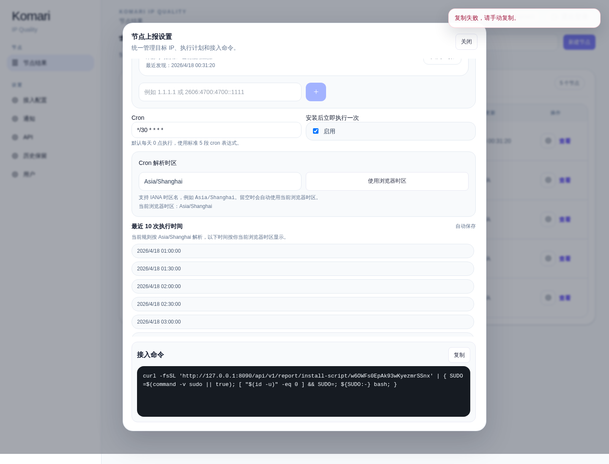

### 18. 节点列表显示有数据

- 目的：节点开始上报后，列表状态会从“无数据”变成“有数据”，最近更新时间也会刷新。
- 操作：等待节点侧命令执行完成，再回到 IPQ 节点列表查看结果。
- 结果：通过

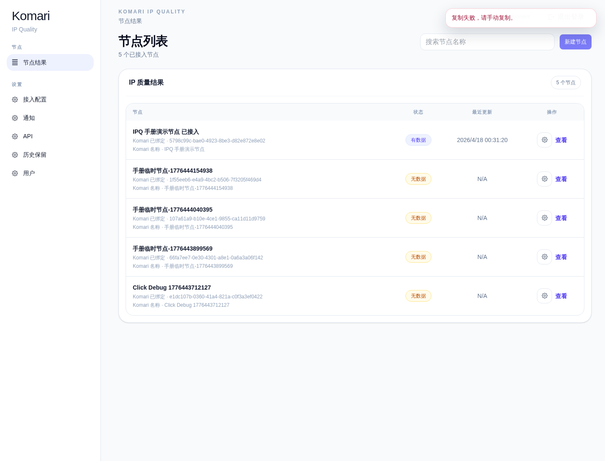

### 19. 查看第一个目标 IP 的当前报告

- 目的：节点详情页会默认展示当前选中目标 IP 的最新体检报告。
- 操作：进入节点详情页，查看 `1.1.1.1` 的当前结果。
- 结果：通过

### 20. 切换到另一个目标 IP

- 目的：多 IP 节点可以通过顶部圆角标签页在不同 IP 之间切换。
- 操作：点击顶部标签页，切换到 `8.8.8.8`。
- 结果：通过

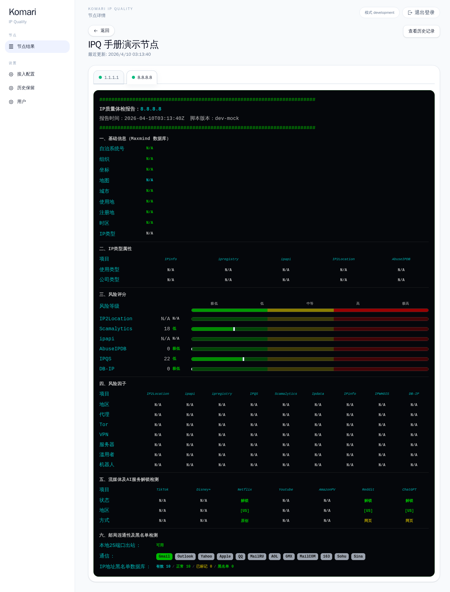

### 21. 查看历史记录

- 目的：历史页支持按时间范围、IP 和字段筛选，并以列表形式展示字段变化。
- 操作：在节点详情页点击“查看历史记录”，打开时间筛选器并选择“今天”。
- 结果：通过
- 说明：当前演示数据已生成字段变化记录。

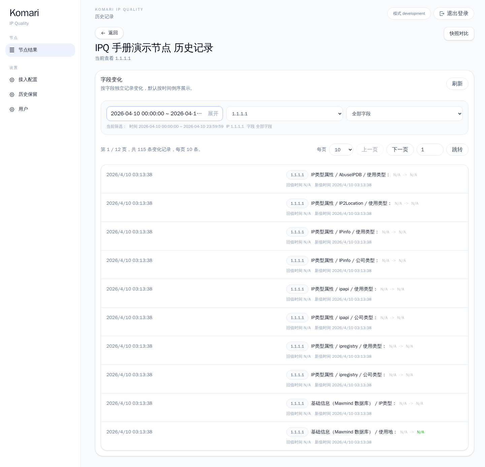

### 22. 查看快照对比

- 目的：快照对比页会用单条时间轴选择两个时间点，并把两份快照并排展示。
- 操作：在历史页点击“快照对比”。
- 结果：通过

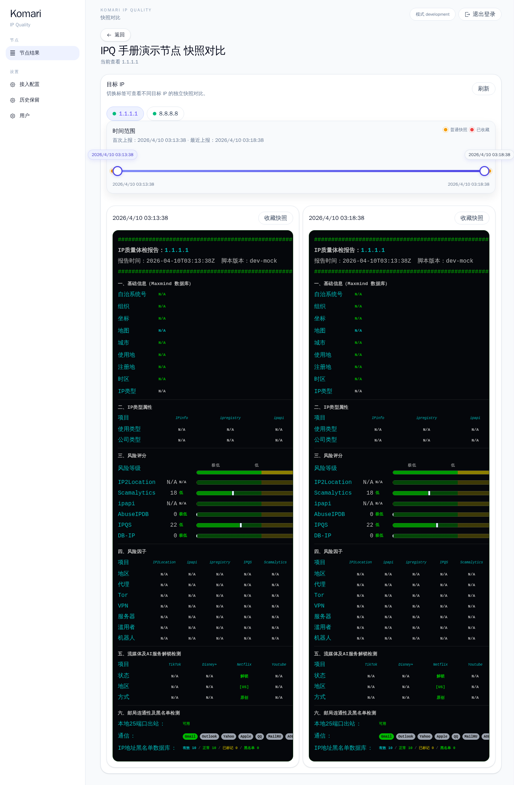

### 23. 收藏快照

- 目的：用户可以把某个时间点的快照收藏起来，避免被全局历史保留策略自动清理。
- 操作：在快照对比页点击“收藏快照”。
- 结果：通过

### 24. 查看历史保留设置

- 目的：历史保留页用于控制快照自动清理窗口，并估算当前占用和增长速度。
- 操作：打开“历史保留”页面。
- 结果：通过

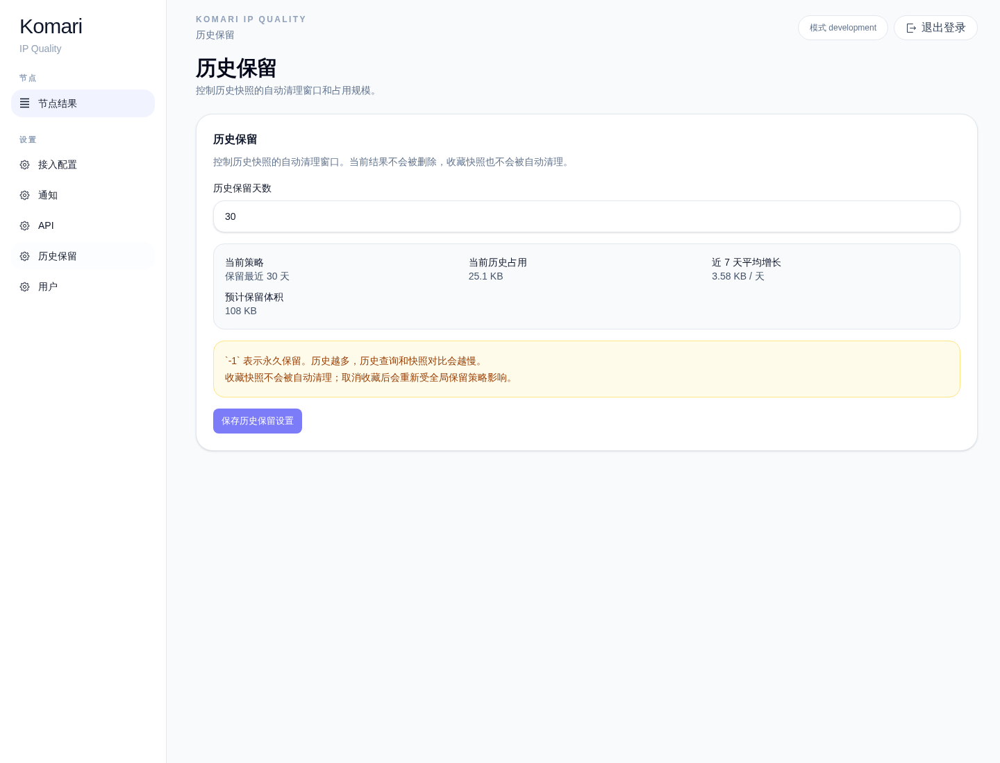

### 25. 保存历史保留策略

- 目的：将保留天数改成具体值后，系统会按全局策略清理普通快照；收藏快照不会被自动删掉。
- 操作：把历史保留天数改为 `30` 并保存。
- 结果：通过

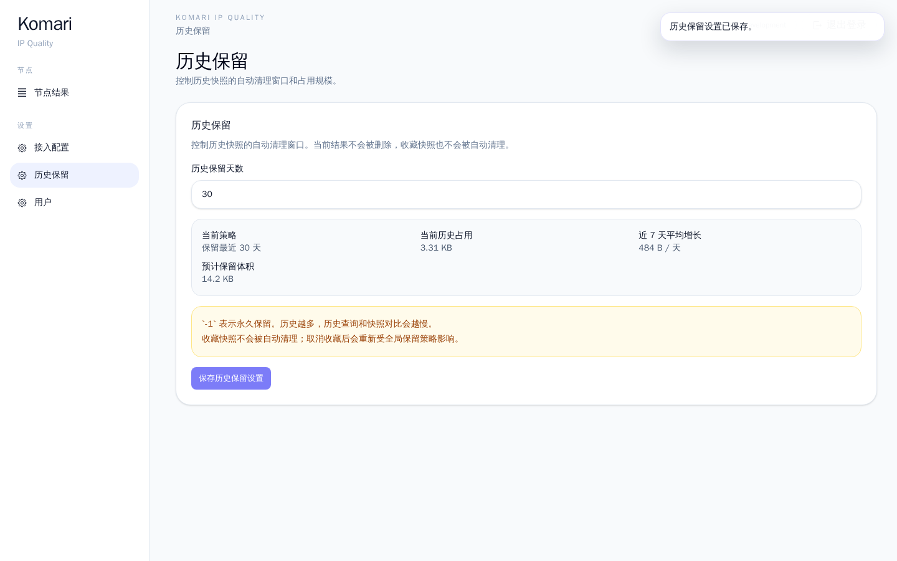

### 26. Komari 默认主题下的管理员弹窗

- 目的：管理员点击注入按钮后，会直接在页内弹窗中查看 IPQ 当前结果，并能跳转到历史记录和快照对比。
- 操作：以 Komari 管理员身份打开节点详情，点击注入按钮。
- 结果：通过

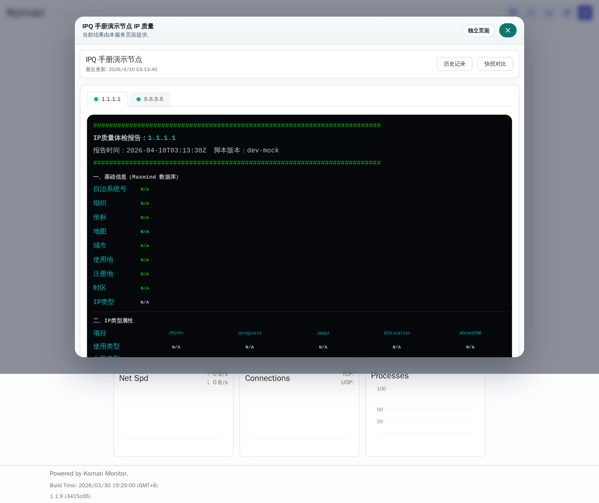

### 27. 默认主题下游客未开放提示

- 目的：当游客只读关闭时，游客仍能看到入口，但点击后只会收到提示，不会打开详情弹窗。
- 操作：使用无登录态浏览器访问 Komari 节点详情并点击注入按钮。
- 结果：通过

### 28. 开放游客只读

- 目的：游客只读只影响 Komari 注入弹窗：关闭时游客只能看到提示，开启后游客可以查看当前结果。
- 操作：在接入配置页勾选“允许游客查看已接入节点的当前结果”并保存。
- 结果：通过

### 29. 默认主题下游客只读弹窗

- 目的：当游客只读开启后，游客可以直接在 Komari 中查看匿名只读结果。
- 操作：使用无登录态浏览器再次打开同一个节点并点击注入按钮。
- 结果：通过

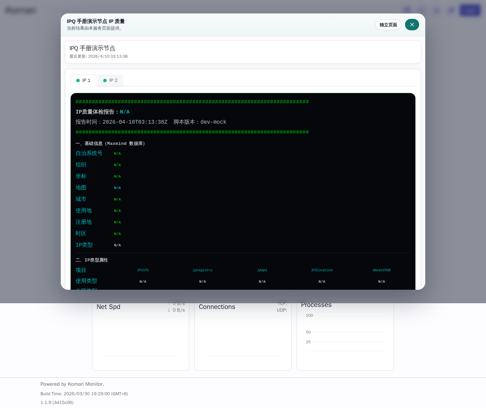

### 30. 打开 Komari 主题管理

- 目的：如果你的 Komari 使用第三方主题，也可以继续使用 IPQ 注入层。
- 操作：在 Komari 后台进入 Theme Management。
- 结果：通过

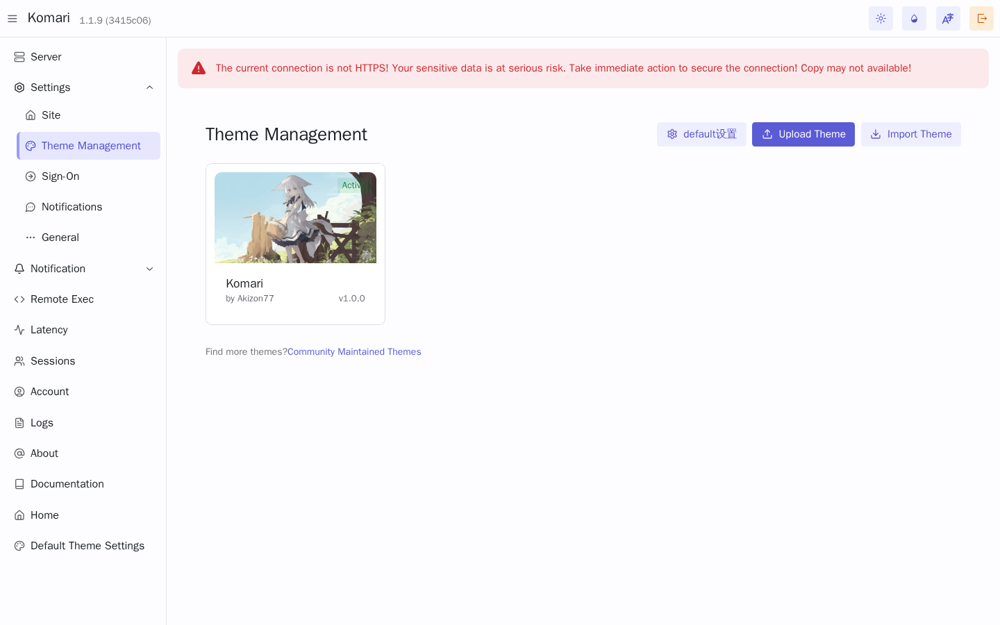

### 31. 上传 PurCarte 主题

- 目的：演示 PurCarte 主题下的注入适配效果。
- 操作：在 Theme Management 中上传 PurCarte 主题压缩包。
- 结果：通过

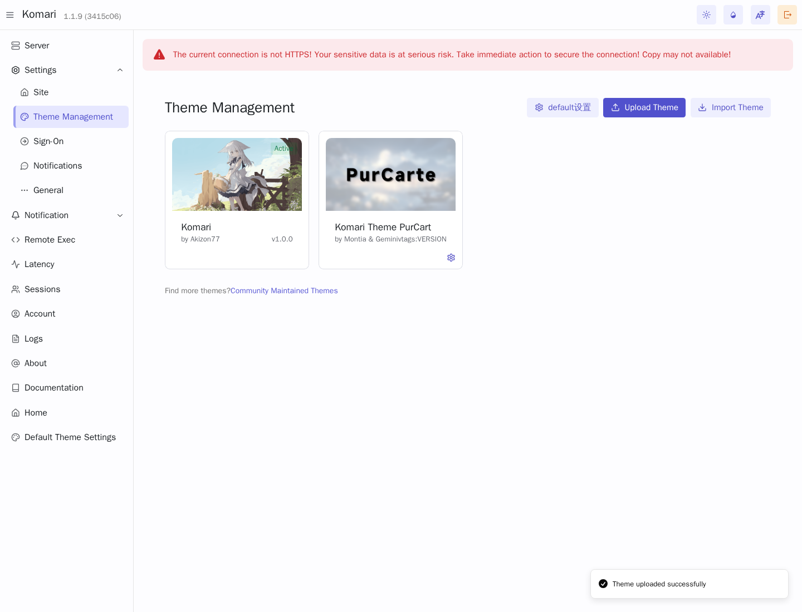

### 32. 启用 PurCarte 主题

- 目的：启用主题后，Komari 首页和节点页会切换成 PurCarte 风格，IPQ 注入按钮和弹窗也会自动跟随。
- 操作：点击 PurCarte 主题卡片上的启用图标。
- 结果：通过

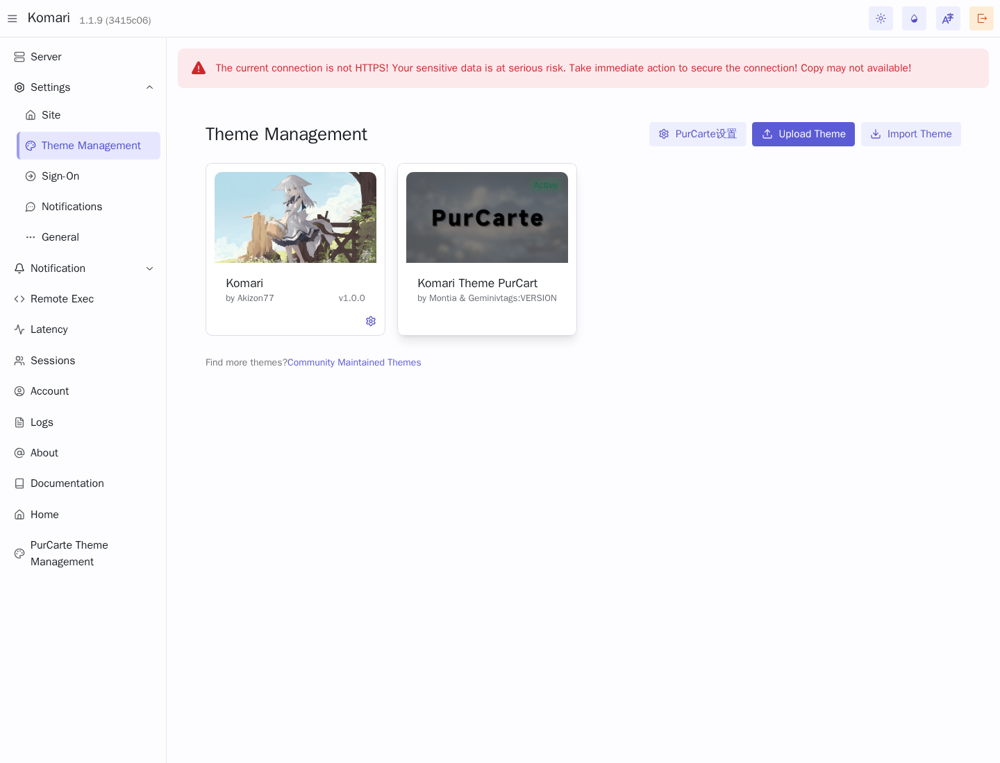

### 33. PurCarte 首页注入入口

- 目的：PurCarte 主题下，IPQ 图标会直接挂到节点卡片区域，并跟随主题视觉风格。
- 操作：切换到 PurCarte 后打开 Komari 首页。
- 结果：通过

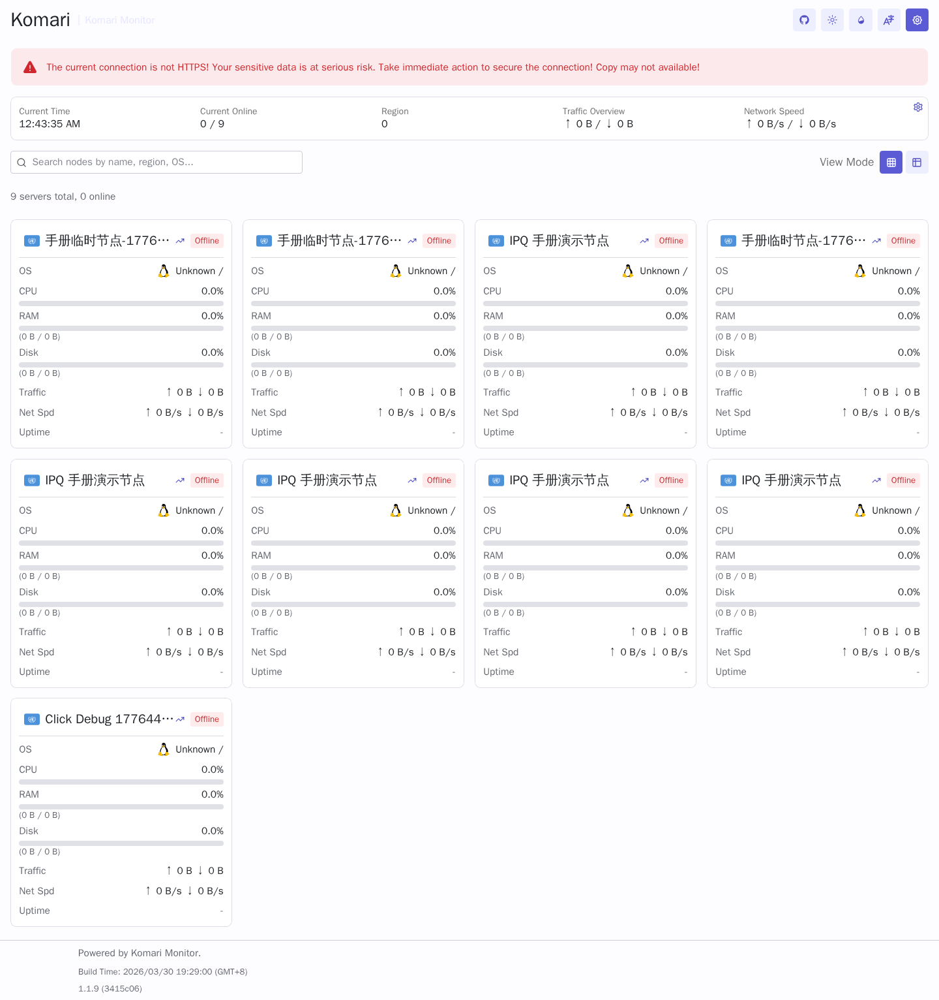

### 34. PurCarte 主题下的管理员弹窗

- 目的：弹窗会自动切换成 PurCarte 的毛玻璃风格，报告本体仍保持 IPQ 自己的展示样式。
- 操作：在 PurCarte 首页节点卡片上点击 IPQ 图标。
- 结果：通过

### 35. 关闭游客只读

- 目的：游客只读只影响 Komari 注入弹窗：关闭时游客只能看到提示，开启后游客可以查看当前结果。
- 操作：在接入配置页取消游客只读并保存。
- 结果：通过

### 36. PurCarte 主题下游客未开放提示

- 目的：PurCarte 下的游客权限逻辑与默认主题一致：未开放时只给提示，不会打开详情。
- 操作：使用无登录态浏览器打开 PurCarte 首页并点击节点卡片上的 IPQ 图标。
- 结果：通过

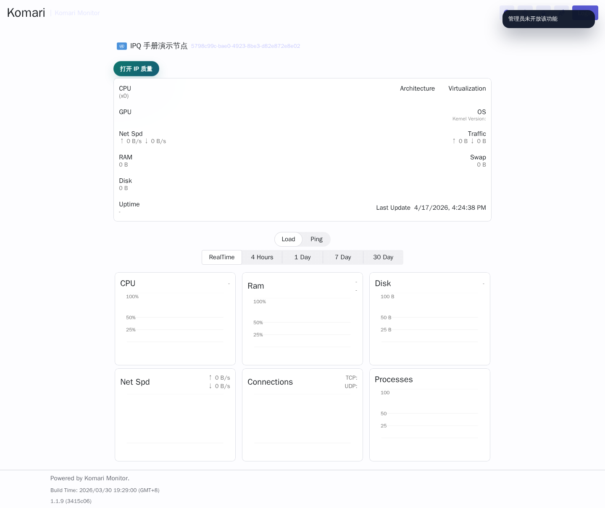

### 37. 开放游客只读

- 目的：游客只读只影响 Komari 注入弹窗：关闭时游客只能看到提示，开启后游客可以查看当前结果。
- 操作：在接入配置页勾选“允许游客查看已接入节点的当前结果”并保存。
- 结果：通过

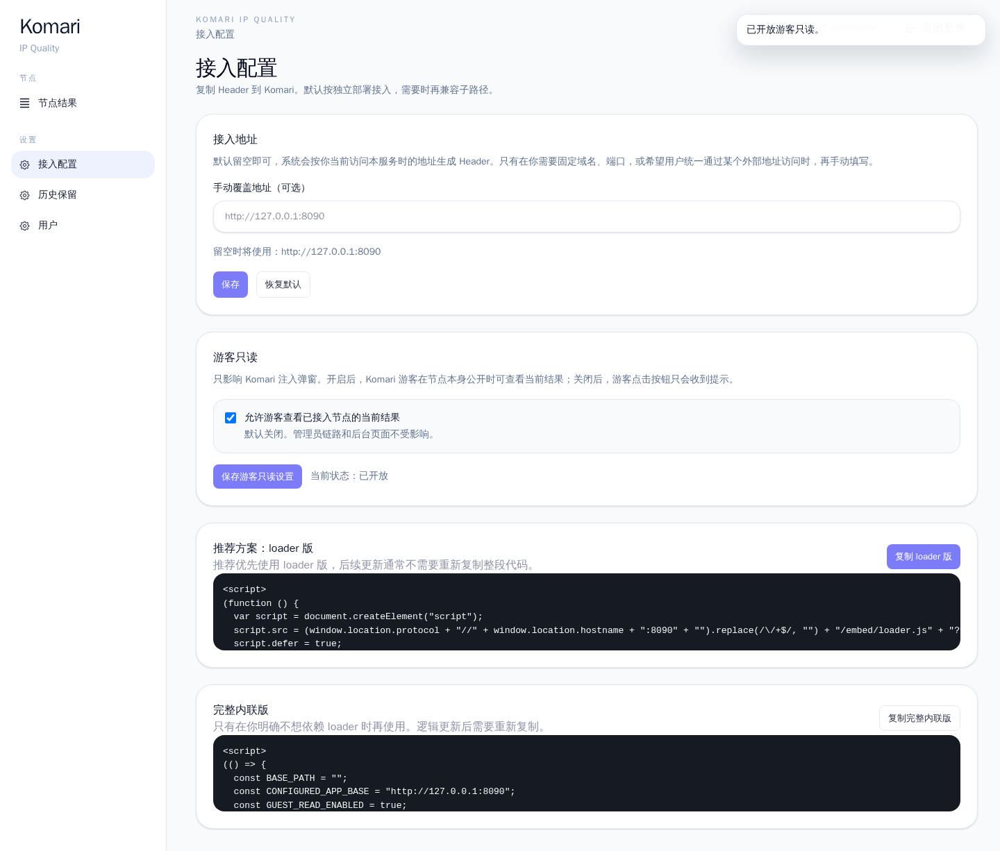

### 38. PurCarte 主题下游客只读弹窗

- 目的：开启游客只读后，PurCarte 主题中的游客也可以直接查看匿名只读结果。
- 操作：使用无登录态浏览器再次点击 PurCarte 首页节点卡片上的 IPQ 图标。
- 结果：通过

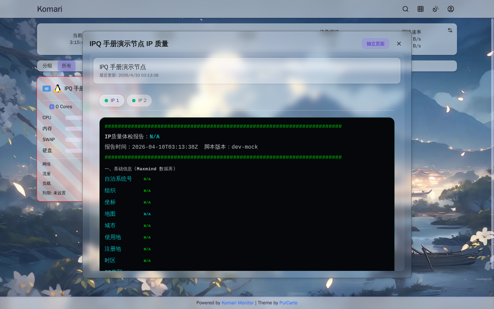

### 39. 查看用户设置

- 目的：用户设置页用于修改后台登录账号和密码，保存后会要求重新登录。
- 操作：打开“用户”设置页。
- 结果：通过

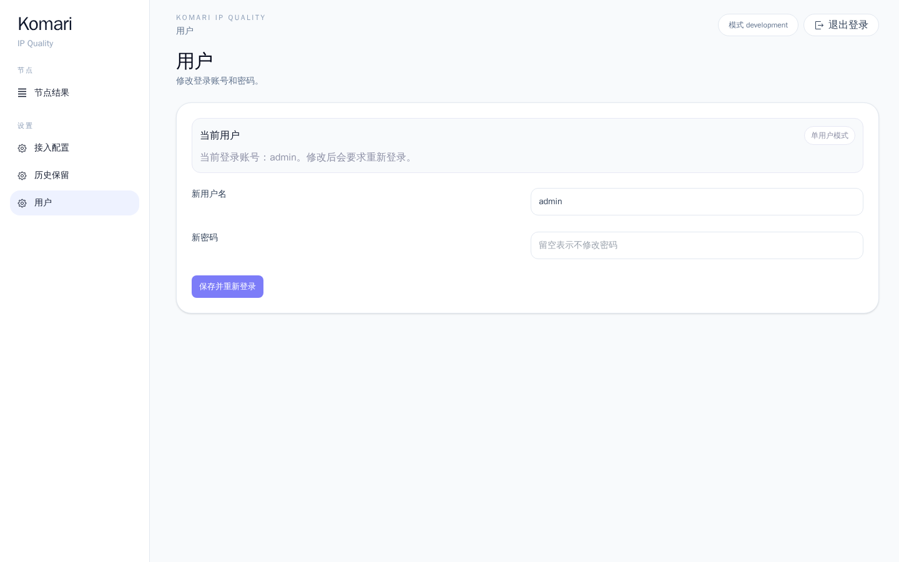

### 40. 保存用户设置后重新登录

- 目的：修改密码后，IPQ 会主动跳回登录页，要求管理员使用新密码重新登录。
- 操作：在用户设置页输入新密码并保存。
- 结果：通过

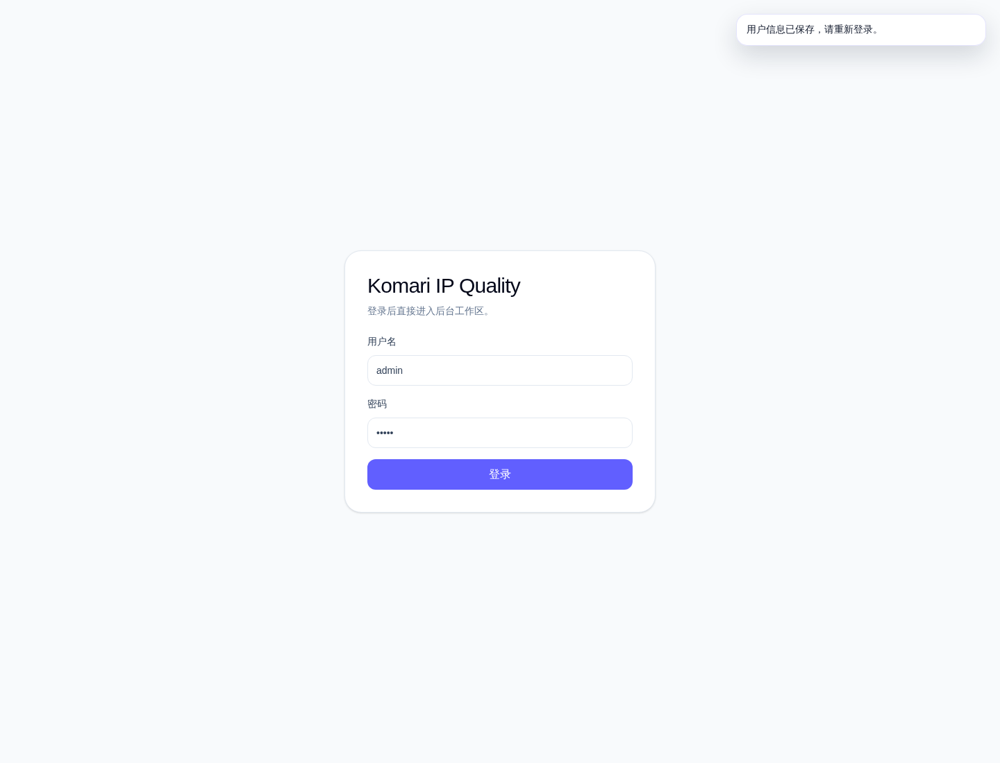

### 41. 使用新密码重新登录

- 目的：修改账号密码后，系统会要求重新登录。
- 操作：在 IPQ 登录页输入更新后的密码重新登录。
- 结果：通过

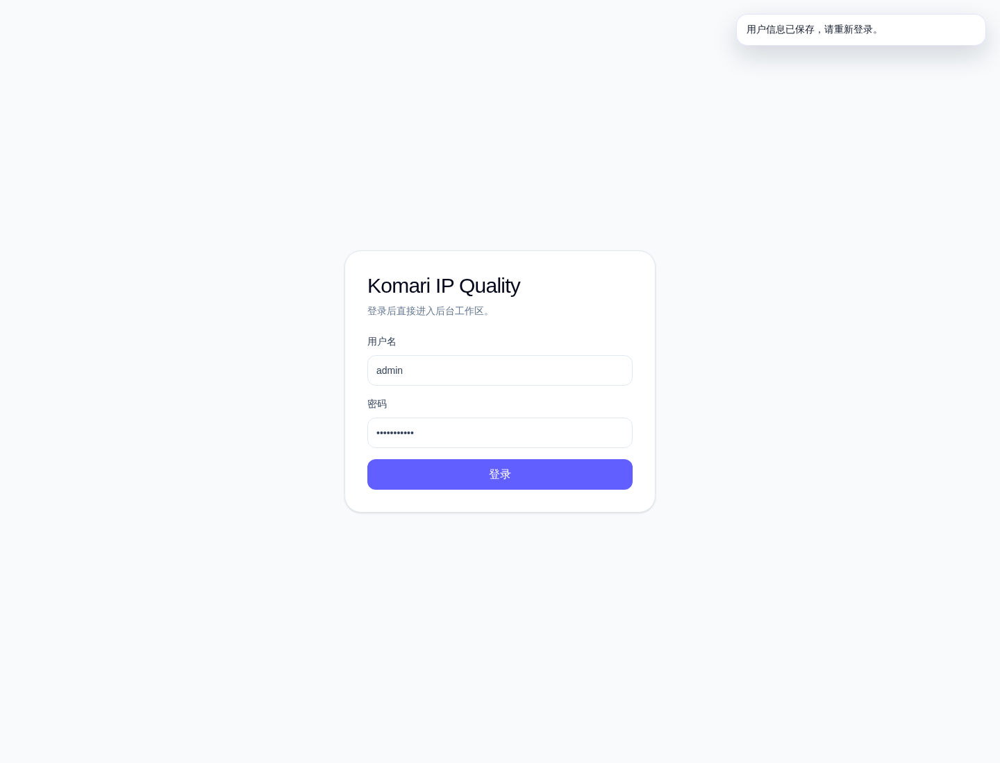

## 补充说明

- `loader 版` 是推荐方案，后续更新注入逻辑时一般不需要重新复制整段 Header。
- 节点上报设置里的接入命令会跟随目标 IP、Cron 和立即执行开关实时变化。
- 历史页主要看“字段变化”，快照对比页主要看“某两个时间点的完整结果差异”。
- 游客只读只影响 Komari 注入弹窗，不影响 IPQ 后台管理员视图。
- 历史保留是全局设置，收藏快照不会被自动清理。
- 快照对比至少需要两条历史快照；如果节点刚接入、暂时只有一条快照，页面会先提示继续等待后续上报。
