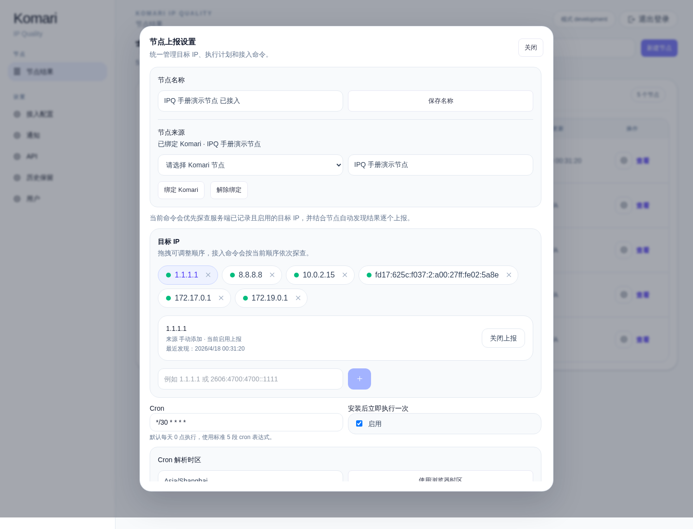
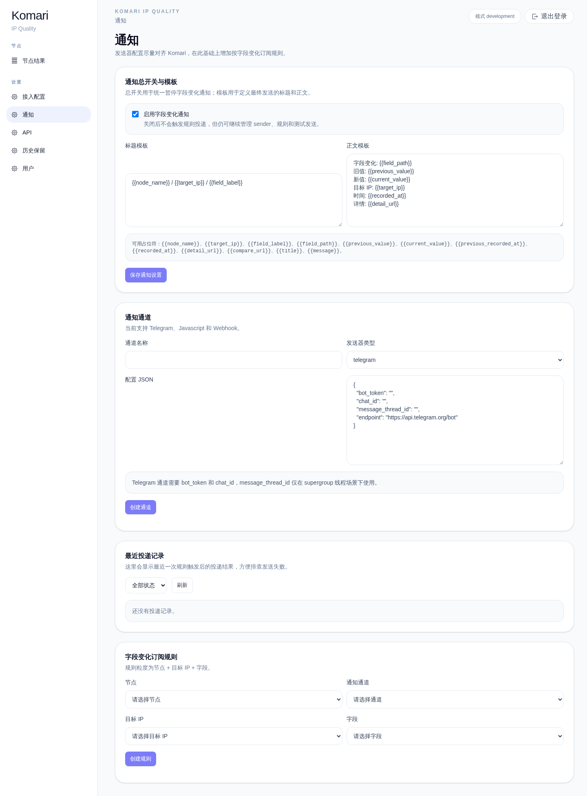
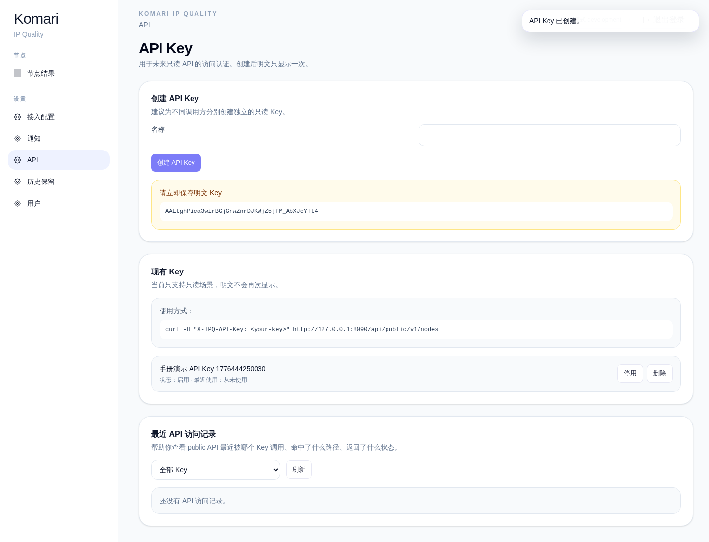
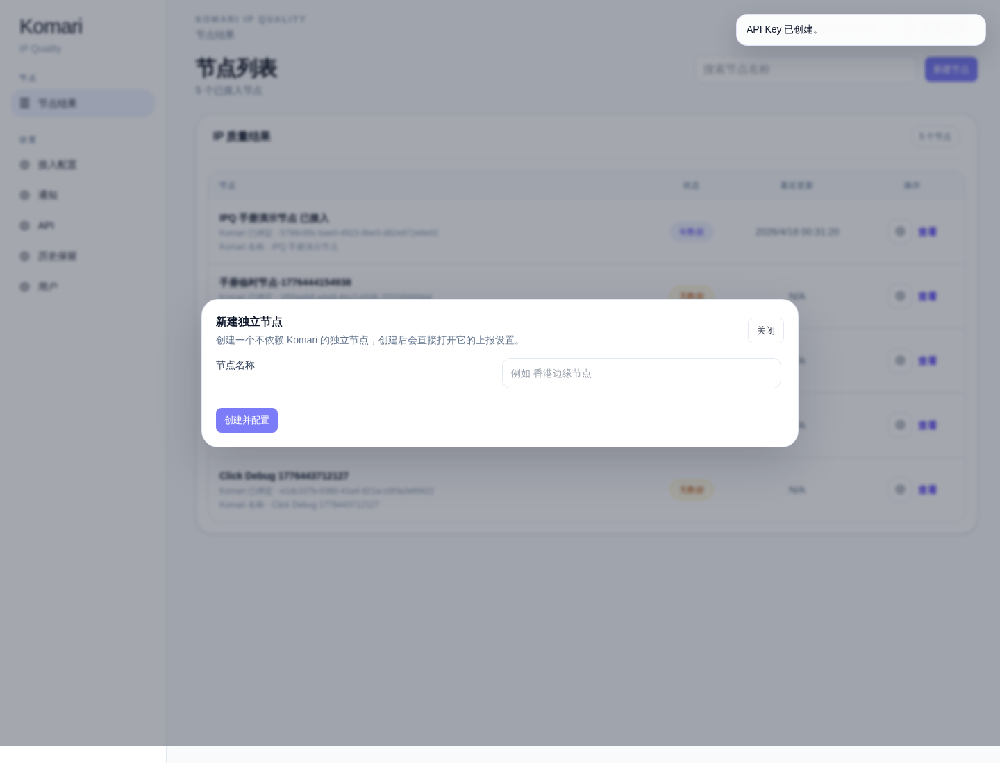
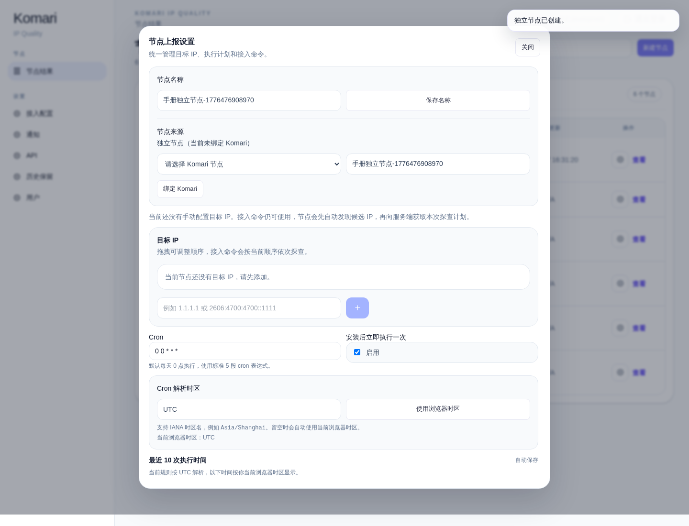
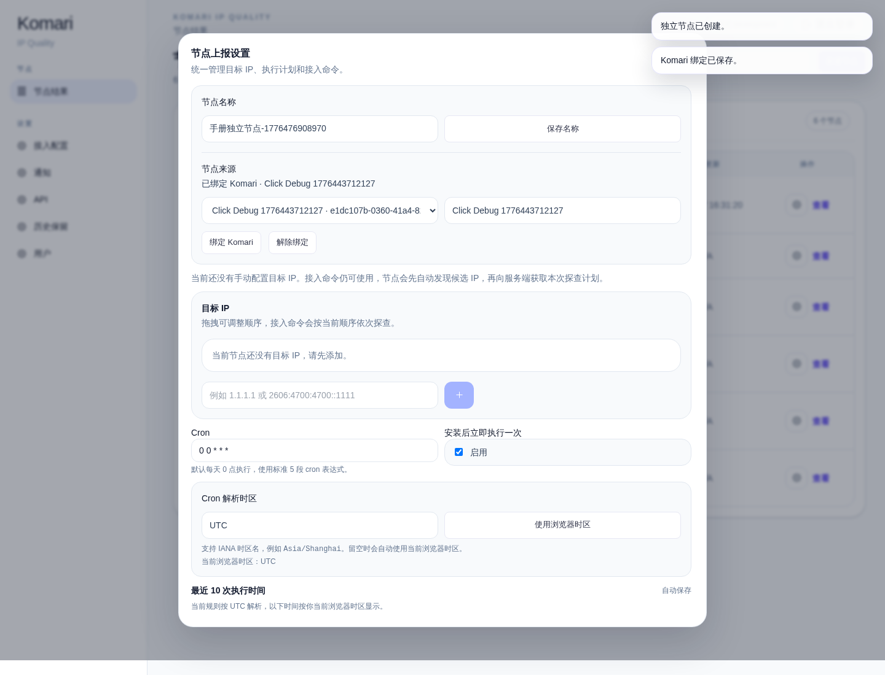

# IPQ 用户操作手册

- 演示环境：Komari `http://127.0.0.1:8080` · IPQ `http://127.0.0.1:8090`
- 默认账号：Komari `admin / admin` · IPQ `admin / admin`
- 演示节点：`IPQ 手册演示节点`
- 演示目标 IP：`1.1.1.1`、`8.8.8.8`

## 说明

- 本手册面向**实际使用者**，按标准使用流程组织，不按“功能清单”罗列。
- 所有截图都来自真实点击流程，不是手工拼图。
- 页面里的接入命令、节点安装、结果回传、通知、API Key 等步骤，均按实际交互顺序演示。

## 标准使用流程

### 1. 打开 Komari 首页

- 目的：先确认 Komari 节点首页可访问，后续从这里进入节点详情和后台。
- 操作：打开 Komari 首页。
- 结果：通过。

### 2. 登录 Komari 管理后台

- 目的：后续创建节点、修改站点 Header 都在 Komari 后台完成。
- 操作：点击登录，输入 `admin / admin`。
- 结果：通过。

### 3. 进入 Komari 后台首页

- 目的：确认已经进入 Komari 管理工作区。
- 操作：提交登录表单后进入 `/admin`。
- 结果：通过。

### 4. 创建 Komari 节点

- 目的：IPQ 通过 Komari 节点 UUID 识别并接入节点，所以先在 Komari 中创建节点。
- 操作：在 Komari 节点列表页点击 `Add`，填写节点名称。
- 结果：通过。

### 5. 确认 Komari 节点创建成功

- 目的：确保后续点击注入入口时能定位到刚创建的节点。
- 操作：回到 Komari 首页或节点列表，确认节点已出现。
- 结果：通过。

### 6. 登录 IPQ 后台

- 目的：复制接入代码、查看节点列表、管理上报设置等操作都在 IPQ 完成。
- 操作：打开 IPQ 登录页，输入 `admin / admin`。
- 结果：通过。

### 7. 确认 IPQ 初始节点列表状态

- 目的：在节点真正接入前，IPQ 列表里不会有这台节点的数据。
- 操作：登录后进入节点列表页。
- 结果：通过。

### 8. 打开接入配置页

- 目的：接入配置页提供 Header 注入代码和游客只读开关。
- 操作：进入 `设置 -> 接入配置`。
- 结果：通过。

### 9. 查看 loader 版与完整内联版代码

- 目的：标准推荐使用 `loader 版`；如果你明确不想依赖 loader，也可以使用完整内联版。
- 操作：先查看 loader 版，再滚动查看完整内联版。
- 结果：通过。

### 10. 把 IPQ Header 粘贴到 Komari

- 目的：只有把 Header 放进 Komari 的 `Custom Header`，节点详情页里才会出现 IPQ 入口。
- 操作：进入 Komari `Site` 设置，把 loader 版代码粘贴到 `Custom Header`。
- 结果：通过。

### 11. 保存 Komari Header

- 目的：让注入逻辑对 Komari 页面正式生效。
- 操作：点击 `Save`。
- 结果：通过。

### 12. 在 Komari 节点详情页确认 IPQ 入口出现

- 目的：确认注入成功。
- 操作：打开刚创建的 Komari 节点详情页，查看是否出现 IPQ 入口按钮。
- 结果：通过。

### 13. 从 Komari 节点页点击 IPQ 入口完成接入

- 目的：未接入节点点击入口后，会在**新标签页**打开 IPQ 后台，并自动弹出该节点的上报设置。
- 操作：点击 IPQ 入口按钮。
- 结果：通过。

### 14. 回到 IPQ 节点列表确认节点已出现

- 目的：确认节点已被 IPQ 正确识别并纳入管理。
- 操作：查看 IPQ 节点列表。
- 结果：通过。

### 15. 打开节点上报设置

- 目的：节点的目标 IP、执行周期、安装命令都在这里管理。
- 操作：点击节点行内齿轮图标，打开“节点上报设置”。
- 结果：通过。

### 16. 配置多个目标 IP、Cron 和时区

- 目的：为节点设置要探测的目标 IP，以及执行周期和解析时区。
- 操作：
  - 添加 `1.1.1.1`
  - 添加 `8.8.8.8`
  - 设置 cron，例如 `*/30 * * * *`
  - 检查“当前规则按哪个时区解析”
- 结果：通过。

### 17. 复制并执行接入命令

- 目的：让节点侧真正安装 reporter 并开始向 IPQ 回传结果。
- 操作：点击接入命令右侧的“复制”，在目标节点执行该命令。
- 结果：通过。

### 18. 确认节点列表出现最新结果

- 目的：节点开始上报后，列表状态会从“无数据”变成“有数据”。
- 操作：回到节点列表刷新查看。
- 结果：通过。

### 19. 查看第一个目标 IP 的当前结果

- 目的：节点详情页默认展示当前选中目标 IP 的最新体检结果。
- 操作：进入节点详情页，查看 `1.1.1.1` 的当前结果。
- 结果：通过。

### 20. 切换到另一个目标 IP

- 目的：多 IP 节点可以在顶部标签中切换不同目标 IP 的当前结果。
- 操作：点击 `8.8.8.8` 标签。
- 结果：通过。

### 21. 在上报设置里启停单个目标 IP

- 目的：单个目标 IP 可以单独暂停或恢复上报，不影响同节点下的其他目标。
- 操作：回到上报设置，选中某个目标 IP，点击 `关闭上报` / `启用上报`。
- 结果：通过。

### 22. 查看历史记录

- 目的：历史页按“字段变化”组织，适合看某个字段什么时候发生了变化。
- 操作：在节点详情页点击“查看历史记录”。
- 结果：通过。

### 23. 查看快照对比

- 目的：快照对比适合直接比较两个时间点的完整结果差异。
- 操作：在历史页点击“快照对比”。
- 结果：通过。

### 24. 收藏快照

- 目的：收藏后的快照不会被历史保留策略自动清理。
- 操作：在快照对比页点击“收藏快照”。
- 结果：通过。

### 25. 调整历史保留策略

- 目的：控制普通历史快照的自动清理窗口。
- 操作：进入 `设置 -> 历史保留`，查看当前估算，再把保留天数改为 `30` 保存。
- 结果：通过。

### 26. 配置通知

- 目的：当字段发生变化时，可以通过通道和规则接收通知。
- 操作：进入 `设置 -> 通知`，查看总开关、模板、通道、规则和投递记录区块。
- 结果：通过。

### 27. 创建 API Key

- 目的：只读 public API 通过 API Key 访问。
- 操作：进入 `设置 -> API`，创建一个新的 API Key，并立即保存明文 key。
- 结果：通过。

### 28. 创建独立节点

- 目的：如果你不是从 Komari 入口接入，也可以直接在 IPQ 内部创建节点。
- 操作：在节点列表页点击 `新建节点`。
- 结果：通过。

### 29. 在独立节点里按需绑定 Komari

- 目的：独立节点创建后，你仍然可以再把它绑定到某个 Komari 节点。
- 操作：在独立节点的上报设置中选择 Komari 节点并绑定。
- 结果：通过。

### 30. 关闭游客只读并验证游客提示

- 目的：当游客只读关闭时，游客点击 IPQ 入口只会看到提示，不会直接查看结果。
- 操作：
  - 在接入配置页关闭游客只读
  - 用无登录态浏览器打开同一个 Komari 节点页并点击 IPQ 按钮
- 结果：通过。

### 31. 开启游客只读并验证匿名查看

- 目的：当游客只读开启后，游客可以直接查看该节点当前结果的匿名只读视图。
- 操作：
  - 在接入配置页开启游客只读
  - 用无登录态浏览器再次点击同一节点的 IPQ 按钮
- 结果：通过。

### 32. 修改登录账号或密码

- 目的：用户设置页用于修改后台登录账号和密码；保存后会要求重新登录。
- 操作：进入 `设置 -> 用户`，修改后点击“保存并重新登录”。
- 结果：通过。

## 附录：PurCarte 主题下的使用方式

如果你的 Komari 使用 PurCarte 主题，IPQ 注入按钮和弹窗仍然可以继续使用。下面是可选参考流程。

### A. 打开 Komari 主题管理

### B. 上传 PurCarte 主题

### C. 启用 PurCarte 主题

### D. 查看 PurCarte 首页中的 IPQ 入口

### E. 查看 PurCarte 主题下的管理员弹窗

### F. PurCarte 主题下的游客只读开关验证

## 使用建议

- 日常接入优先使用 `loader 版` Header。
- 接入命令由页面实时生成；目标 IP、cron、时区变化后，建议重新复制一次。
- 历史页更适合看“字段变化”，快照对比更适合看“两个时间点的完整结果差异”。
- 如果需要对外只读访问，建议为每个调用方单独创建独立 API Key。
- 如果节点脚本刚装好、暂时只有一条结果，历史和快照对比页可能需要等待后续上报后才更有参考价值。
